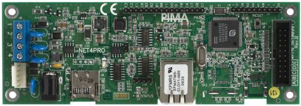
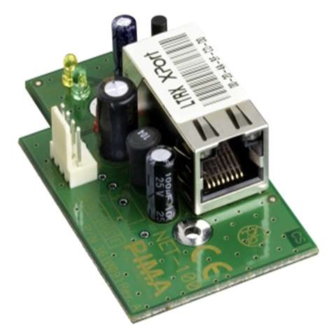

# PIMA Alarm for Home Assistant

[](https://github.com/custom-components/hacs)

Control your PIMA alarm system with **Net4Pro** network card from Home Assistant.

## Introduction

PIMA makes two separate TCP-enabled cards:

**Net4Pro (supported)** - PIMA's card for supporting the iPIMA Mobile App. The communication protocol between the app and the card is undocumented, fragile, and slow. It also disables the keypad when a client connects to it. So no, this card isn't a great option for home automation. On the bright side, with this integration you can still incorporate it into your favorite automations.

<div align="left"></div>
<br/>

**Net4Pro-i (not supported)** - Optional Home Automation Kit component, and uses the serial interface's protocol. This card is the preferred way to go. It is already supported with an add-on by [@deiger](https://github.com/deiger/Alarm/). This card responds quickly, supports more features like outputs, and is generally more robust.

<div align="left"></div>

### Requirements

1. PIMA Hunter Pro™ alarm system
2. PIMA Net4Pro™ network card ([Installer PDF](https://www.pima-alarms.com/wp-content/uploads/Installation_guides/English/iPima-App-Installation-Use-XX-en-C3-Dec-2017.pdf))
3. Static IP address for your PIMA system (configure via PIMA settings or DHCP reservation)
4. Your alarm system code (user's setting code, not the technician code)

## Features

1. **Native alarm control panel entity** - Full integration with Home Assistant's alarm panel UI
2. **Optimistic updates** - Instant UI response with background verification
3. **Configurable polling** - Adjustable status check interval (5-60 minutes)
4. **Minimal keypad lock time** - Connections released immediately after commands

## Installation

### HACS Installation (Recommended)

This integration is not yet in the default HACS repository. Add it as a custom repository:

1. In Home Assistant, go to **HACS** → **Integrations**
2. Click the **⋮** menu (top right) and select **Custom repositories**
3. Add repository URL: `https://github.com/birsch/pima4ha`
4. Select category: **Integration**
5. Click **Add**
6. Click **+ Explore & Download Repositories**
7. Search for **PIMA Alarm** and click **Download**
8. Restart Home Assistant

### Manual Installation

1. Download the latest release from GitHub
2. Copy the `custom_components/pima` folder to your Home Assistant `config/custom_components/` directory
3. Restart Home Assistant

## Configuration

After installation, add the integration:

1. Go to **Settings** → **Devices & Services**
2. Click **+ Add Integration**
3. Search for **PIMA Alarm**
4. Enter your configuration:

| Parameter | Required | Default | Description |
|-----------|----------|---------|-------------|
| IP Address | Yes | - | Your PIMA system IP address (e.g., `192.168.1.100`) |
| Port | No | `10150` | TCP port for PIMA communication |
| Alarm Code | Yes | - | Your alarm user code (4-6 digits) |
| Scan Interval | No | `600` | Status polling interval in seconds (300-3600) |

**Note:** The alarm code is stored in the integration configuration and used automatically - you won't need to enter it when arming/disarming.

## Usage

This integration conforms to Home Assistant's built-in `alarm_control_panel`:

**States:**
- `disarmed` - Alarm is off
- `armed_away` - All zones armed
- `armed_home` - Home zones armed (Home 1)
- `armed_night` - Night mode armed (Home 2)

**Services:**
- `alarm_control_panel.alarm_arm_away` - Arm all zones
- `alarm_control_panel.alarm_arm_home` - Arm home zones
- `alarm_control_panel.alarm_arm_night` - Arm night mode
- `alarm_control_panel.alarm_disarm` - Disarm alarm

### Example Automation

```yaml
automation:
  - alias: "Arm alarm when leaving"
    trigger:
      - platform: state
        entity_id: person.john
        to: "not_home"
    action:
      - service: alarm_control_panel.alarm_arm_away
        target:
          entity_id: alarm_control_panel.pima_alarm
```

## Troubleshooting

### Connection Issues
- Verify PIMA system IP address and network connectivity
- Ensure port 10150 (UDP and TCP) is accessible
- Check alarm code is correct
- Ensure UDP wake-up packets can reach the device

### Slow Response
- This is normal - PIMA protocol can take 15-30 seconds to respond
- The integration uses optimistic updates for instant UI feedback
- Increase scan interval if experiencing issues
- Physical keypad may be locked during network operations

### Debug Logging

Enable debug logging in `configuration.yaml`:

```yaml
logger:
  default: info
  logs:
    custom_components.pima: debug
```

Then check logs at **Settings** → **System** → **Logs**

### Locked Keypad

This integration locks the keypad each time it performs an arm/disarm action, or when checking for status (every 10 min by default). It then immediately disconnects to release the keypad. If the physical keypad is locked:
1. Wait for up to a minute to see if it is released
2. Consider increasing the scan interval to reduce connection frequency

## Developers

### Implementation Notes

- This integration reverse-engineers the communication between the iPhone app and the Net4Pro card
- When connected, the physical keypad is temporarily locked
- Connections are released immediately after each command to minimize keypad lock time
- Status polling is configurable to balance responsiveness vs. keypad availability
- Optimistic updates provide instant UI feedback while background polling verifies state

### Protocol Details

This integration uses the PIMA Net4Pro network protocol:
- UDP wake-up packets (required before TCP connection)
- TCP communication on port 10150
- CRC16/XMODEM checksumming
- Optimized for slow response times (15-30+ seconds possible)

#### Message Structure

| Type     | Structure                                                        | Example                                   |
|----------|------------------------------------------------------------------|-------------------------------------------|
| Request  | `\xdb + \xff + ascii_command + CRC16/XMODEM checksum + \xdc`    | dbff53533d31e66ddc (status)               |
| Response | `\xdb + ascii_response + CRC16/XMODEM checksum + \xdc`          | db53533d30ebe1e5e9e420207e5bdc (disarmed) |

#### Commands

| Command | Command ASCII                        | Response ASCII                               | Example        |
|---------|--------------------------------------|----------------------------------------------|----------------|
| Login   | PW=XXXX (XXXX: user's code)          | R=1                                          | PW=1234 → R=1  |
| Status  | SS=1                                 | S=X (X: 0-disarmed, 1-away, 2-home, 3-night) | SS=1 → S=2     |
| Arm     | AR=X (X: 1: away, 2: home, 3: night) | S=X (X: 0-disarmed, 1-away, 2-home, 3-night) | AR=1 → S=1     |
| Disarm  | DA=1                                 | S=0                                          | DA=1 → S=0     |

### Standalone Protocol Testing

Test the protocol without Home Assistant:

```bash
# Install dependency
pip3 install crcmod

# Run test
python3 test_protocol.py --ip 192.168.1.100 --code 1234

# With custom port
python3 test_protocol.py --ip 192.168.1.100 --port 10150 --code 1234
```

**Arguments:**
- `--ip` (required): IP address of your PIMA system
- `--port` (optional): TCP port (default: 10150)
- `--code` (required): Your alarm user code

### Contributing

Contributions are welcome! Please feel free to submit a Pull Request.

## License

MIT License

## Credits

Protocol reverse-engineered from iPima mobile app network traffic analysis.

PIMA™ and its logo are trademarks of PIMA Electronic Systems Ltd, http://www.pima-alarms.com.
This integration was built with no affiliation with PIMA Electronic Systems Ltd.